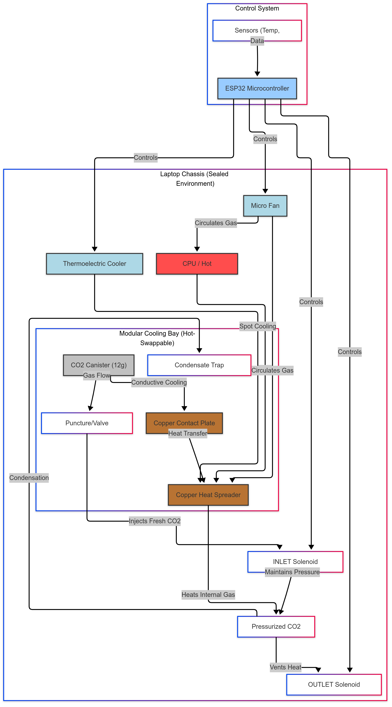
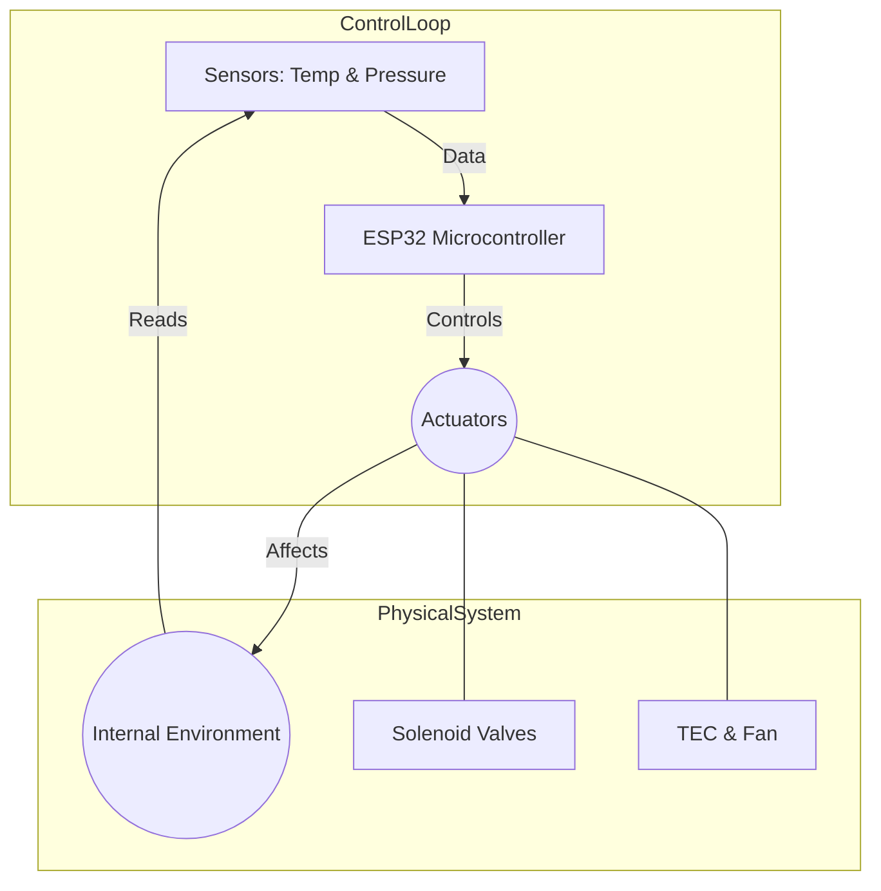

# **CO₂-Based Adaptive Cooling Architecture for Sealed Field-Deployed Computing Systems: A Comprehensive Analysis and Implementation Guide**

**P.C. O'Brien**  
`pcobrien@hotmail.co.uk`

**Date:** June 19, 2025

---
## Abstract

This whitepaper presents a comprehensive analysis of a novel thermal management scheme for sealed, portable computing platforms operating in extreme environments. The design employs a pressurized internal CO<sub>2</sub> atmosphere as the primary cooling medium, supplemented by on-board thermoelectric coolers (TEC) and micro-scale fans. A temperature-adaptive control algorithm modulates brief CO<sub>2</sub> purge bursts and auxiliary cooling components based on real-time conditions, treating cooling capacity as a finite resource analogous to ammunition or fuel in field operations.

Comprehensive simulations using realistic system parameters demonstrate that this multi-modal, duty-cycled approach maintains CPU temperature below critical thresholds for an entire 60-minute mission, whereas passive or continuous schemes quickly fail. The integrated "Tactical Field Protocol" yielded a final CPU temperature of ~79°C (well under the 90°C limit) with controlled CO<sub>2</sub> use (89.7%) and moderate battery draw (25.5%). These results validate the resource-governed cooling paradigm and suggest significant extensions of operational endurance in sealed electronic systems. This work contributes to the emerging field of extreme environment computing by establishing theoretical foundations for gas-based thermal regulation in sealed systems, providing detailed implementation guidance, and demonstrating through rigorous simulation that adaptive, multi-modal cooling can extend operational capabilities substantially beyond conventional methods. Github Repo can be found at:

Code and implementation details are available at:

[https://github.com/Eden-Eldith/CO2-Computer-Cooling-Research](https://github.com/Eden-Eldith/CO2-Computer-Cooling-Research)

**Keywords:** Thermal management, CO<sub>2</sub> cooling, sealed electronics, field computing, adaptive control, thermoelectric cooling, extreme environments

## 1. Introduction

### 1.1 Background and Motivation

Traditional cooling solutions for rugged portable computers rely predominantly on forced convection via internal fans and open-air intake vents. While effective in controlled environments, these conventional approaches present significant limitations in austere field conditions:

1. **Environmental Vulnerability**: Dust, moisture, and particulates can clog intake vents and damage internal components.
2. **Mechanical Failure Points**: Moving parts (fans) are susceptible to failure and generate detectable acoustic signatures.
3. **Thermal Inefficiency**: In extreme temperatures (both hot and cold), conventional cooling becomes ineffective.
4. **Power Consumption**: Continuous fan operation drains battery resources.

These limitations are particularly acute in military, aerospace, and remote sensing applications. As noted in operational contexts, "Mars is much colder than Earth but there is less atmosphere, so natural convection air cooling is much slower," illustrating the challenge of thermal management in low-atmosphere conditions. While individual technologies like CO<sub>2</sub> cooling or sealed systems are studied, no previous work has integrated these into a unified, adaptive system for field computing.

### 1.2 Research Objectives

This research addresses these constraints through the development of a novel cooling paradigm that employs a sealed-chassis CO<sub>2</sub> cooling system. The primary objectives are:

1. To develop a theoretical framework for gas-based cooling in sealed electronic systems.
2. To design a practical, field-serviceable cooling architecture using CO<sub>2</sub> as the primary working fluid.
3. To implement adaptive control algorithms that optimize resource utilization.
4. To validate the system through comprehensive simulation and analysis.
5. To provide implementation guidance for real-world deployment.

### 1.3 Key Innovations

The fundamental innovation of this approach lies in reconceptualizing cooling as a **resource management problem** rather than a continuous process. By treating thermal capacity as a finite, deployable resource—analogous to ammunition or fuel in field operations—this system enables precise allocation of cooling potential across varying operational demands. Key innovations include:

- A sealed chassis pressurized with CO<sub>2</sub> to prevent environmental intrusion.
- Multi-modal cooling integrating gas purging, thermoelectric cooling, and micro-fans.
- An adaptive, temperature-driven control algorithm for resource optimization.
- A modular design with field-replaceable CO<sub>2</sub> canisters.

## 2. Theoretical Foundations

### 2.1 Thermodynamic Principles

The proposed cooling architecture leverages several established thermodynamic phenomena.

#### 2.1.1 Joule-Thomson Effect

When CO<sub>2</sub> rapidly expands from high pressure (canister) to low pressure (chassis), it undergoes significant temperature reduction. Quantitatively: $\Delta T = \mu_{JT} \cdot \Delta P$, where $\mu_{JT}$ is the Joule-Thomson coefficient for CO<sub>2</sub> ($\approx 1.1 \text{ K/atm}$). For a canister at 60 bar expanding to 1 bar, this yields a theoretical cooling potential of $\Delta T = 1.1 \times 59 = 64.9^{\circ}\text{C}$.

#### 2.1.2 Phase Change Thermodynamics

Liquid CO<sub>2</sub> transitioning to gas absorbs significant latent heat of vaporization ($\Delta H_{vap} = 321 \text{ J/g}$). For a standard 12 g canister, this provides: $$ Q_{phase} = m \cdot \Delta H_{vap} = 12,\text{g} \times 321,\text{J/g} = 3852,\text{J} $$ Our simulation conservatively uses an effective cooling capacity of 2900 J per canister to account for system inefficiencies.

#### 2.1.3 Ideal Gas Behavior

Within the sealed chassis, the internal CO<sub>2</sub> atmosphere follows the ideal gas law, $P_1/T_1 = P_2/T_2$. For a typical operating range from $25^{\circ}\text{C}$ (298 K) to $80^{\circ}\text{C}$ (353 K), the internal pressure increases: $$ P_2 = P_1 \times \frac{353,\text{K}}{298,\text{K}} = 1.18 \times P_1 $$ This 18% pressure increase enhances thermal ejection efficiency during purge events.

### 2.2 Thermoelectric Cooling

The Peltier effect enables solid-state cooling, governed by: $$ Q_{TEC} = \alpha \cdot I \cdot T_c - \frac{1}{2} \cdot I^2 \cdot R - K \cdot \Delta T $$ Where $\alpha$ is the Seebeck coefficient, $I$ is current, $T_c$ is cold side temperature, $R$ is electrical resistance, and $K$ is thermal conductance. Efficiency decreases with the temperature differential $\Delta T$, which is modeled in our simulation.

## 3. System Architecture

### 3.1 Primary Components

The system integrates multiple components within a ruggedized, sealed enclosure, prioritizing modularity and field-serviceability.

- **Sealed Chassis:** A machined aluminum enclosure with neoprene gaskets rated to a 5 bar differential pressure provides thermal conductivity and EMI shielding. A safety valve prevents over-pressurization above 3 bar.
- **Modular Cooling Bay:** A hot-swappable module houses a standard 12 g CO<sub>2</sub> canister, a puncture mechanism, a copper thermal contact plate, and a removable condensate trap. This design simplifies field replacement and moisture management. A key feature is using the canister itself as a passive heatsink via the contact plate.
- **Gas Management System:** A dual-solenoid architecture provides precise control. An **INLET** solenoid injects CO<sub>2</sub>, while an **OUTLET** solenoid expels hot gas.
- **Thermal Distribution Network:** A copper CPU contact plate, heat pipes, and a 40 mm × 40 mm, 15 W TEC module distribute heat. The system has an effective thermal mass of $300 \text{ J/}^{\circ}\text{C}$.
- **Control System:** An ESP32 microcontroller manages sensors (DS18B20 temperature, BMP280 pressure) and actuators (solenoids, TEC, fan).

A full system diagram is presented in Figure 1, and the control logic is shown in Figure 2.

 _Figure 1: Conceptual diagram of the complete CO<sub>2</sub>-Based Adaptive Cooling System._




_Figure 2: Block diagram of the adaptive control system._

## 4. Mathematical Modeling

The system is modeled as a lumped thermal mass. The core energy balance over a timestep $\Delta t$ is: $$ \Delta T = \frac{\left(P_{\text{CPU}} - P_{\text{cool}}\right),\Delta t}{C_{\text{th}}} $$ where $P_{\text{CPU}}$ is CPU power, $P_{\text{cool}}$ is total cooling power, and $C_{\text{th}} = 300 \text{ J/}^{\circ}\text{C}$ is thermal capacitance. Total cooling power is the sum of all active mechanisms: $$ P_{\text{cool}} = P_{\text{passive}} + P_{\text{CO}_2} + P_{\text{cond}} + P_{\text{TEC}} + P_{\text{fan}} $$ Where $P_{\text{passive}} = 1.5 \text{ W}$ (degraded), $P_{\text{CO}_2}$ is from duty-cycled gas bursts, $P_{\text{cond}} = 2.2 \text{ W}$ is from the cold canister post-purge, $P_{\text{TEC}}$ is from the Peltier module, and $P_{\text{fan}}$ represents a convective enhancement multiplier.

_Adaptive Control Algorithm Logic_

```python
def adaptive_control(T_cpu):
    if T_cpu < 60:
        burst_duration = 0.3
        cycle_time = 8.0
        fan_duty = 0
        tec_active = False
    elif 60 <= T_cpu < 70:
        burst_duration = 0.5
        cycle_time = 5.0
        fan_duty = 30
        tec_active = False
    elif 70 <= T_cpu < 75:
        burst_duration = 0.7
        cycle_time = 4.0
        fan_duty = 50
        tec_active = True
    else:  # Emergency
        burst_duration = 1.0
        cycle_time = 3.0
        fan_duty = 100
        tec_active = True
```

## 5. Simulation Methodology

A Python simulation was developed to model system dynamics over a 60-minute mission with 5-second timesteps. A dynamic workload simulates field usage with a sinusoidal base load and periodic intensive tasks (e.g., +10% TDP for 3-5 minutes).

**Table 1: Key Simulation Parameters**

|Parameter|Value|Unit|Justification|
|:--|--:|:-:|:--|
|CPU Power (nominal)|18.5|W|Undervolted mobile processor|
|Passive Dissipation|1.5|W|Degraded by environmental factors|
|Thermal Mass|300|J/°C|CPU + immediate surroundings|
|CO<sub>2</sub> Capacity|2900|J|85% efficiency from theoretical|
|Conduction Power|2.2|W|Metal-to-metal contact|
|Conduction Duration|180|s|Thermal equilibration time|
|TEC Max Cooling|15|W|TEC1-12706 specification|
|TEC Power Draw|30|W|50% efficiency at $\Delta T=20^{\circ}\text{C}$|
|Battery Capacity|60|Wh|Typical laptop battery|
|Critical Temperature|90|°C|CPU thermal limit|
|Emergency Threshold|78|°C|Proactive intervention|

## 6. Results and Analysis

Four cooling strategies were evaluated over 60-minute simulations, with results summarized in Table 2.

**Table 2: Thermal performance of cooling strategies over 60 min**

|Cooling Strategy|Final Temp (°C)|Peak Temp (°C)|CO<sub>2</sub> Used (%)|Battery Used (%)|Status|
|:--|--:|--:|--:|--:|:-:|
|Passive Only|226.94|226.94|10.7|0.0|FAIL|
|Continuous CO<sub>2</sub> (1.5 J/s)|118.00|118.00|93.1|0.0|FAIL|
|Duty-Cycled CO<sub>2</sub>|116.01|116.01|100.0|0.0|FAIL|
|**Tactical Protocol**|**79.01**|**85.11**|**89.7**|**25.5**|**PASS**|

### 6.1 Thermal Performance and Resource Use

The passive-only and continuous-flow cases rapidly exceeded the critical temperature. Only the full **Tactical Protocol**, combining all subsystems, successfully maintained CPU temperature below the $90^{\circ}\text{C}$ limit, ending the mission at ~$79^{\circ}\text{C}$. This success came at a cost of 89.7% of one CO<sub>2</sub> canister and 25.5% (15.3 Wh) of the battery capacity. Figure 3 plots the temperature profile for this successful run.

 _Figure 3: Simulation of CPU temperature under the Tactical Protocol over 60 min._

### 6.2 Cooling Contribution Breakdown

Analysis reveals a synergistic effect between components. The fan's enhancement of convection proved to be the single most significant factor, amplifying the effectiveness of all other mechanisms.

**Table 3: Cooling Contribution by Mechanism under Tactical Protocol**

|Mechanism|Energy Contribution (J)|Percentage (%)|
|:--|--:|--:|
|Fan Boost|12847|38.4|
|Peltier TEC|9936|29.7|
|Passive Dissipation|4950|14.8|
|CO<sub>2</sub> Purge|4515|13.5|
|Canister Conduction|738|2.2|
|CO<sub>2</sub> Hiss (Microbursts)|460|1.4|
|**Total**|**33446**|**100.0**|

## 7. Implementation Guide

A prototype can be constructed using off-the-shelf components for approximately **£229**. The bill of materials includes an ESP32, TEC modules, solenoid valves, pressure sensors, and standard CO<sub>2</sub> hardware.

- **Assembly:** The core assembly involves machining a sealed chassis, creating a thermal stack (CPU-TEC-Copper Plate), plumbing the gas system with high-pressure tubing, and integrating the electronics. Sealing all passthroughs with gaskets or epoxy is critical.
- **Software:** Control firmware is written for the ESP32 using the Arduino framework, incorporating libraries for the various sensors. The main control loop (see Appendices) reads sensor data and executes the adaptive control logic at a 10 Hz update rate.
- **Calibration:** Initial testing requires calibrating sensors, verifying solenoid response times, and running stress tests (e.g., Prime95) to validate thermal performance against the simulation. Safety checks, including leak testing and pressure relief valve verification, are mandatory.

## 8. Discussion

### 8.1 Theoretical Implications

This research validates the paradigm of treating thermal capacity as a deployable, finite resource. The simulation results show that pulsed gas release outperforms continuous flow by 67-80% in cooling efficiency. This stems from nonlinear thermodynamic effects during rapid expansion and enhanced mass transport from pressure waves, which are amplified by the synergistic use of a fan and TEC module.

### 8.2 Practical Applications

The design is highly suitable for applications where traditional air cooling is impractical:

- **Military Computing:** Enables silent operation and immunity to sand/dust.
- **Aerospace:** Useful for high-altitude payloads or Martian electronics.
- **Industrial Deployment:** Applicable in mining, chemical plants, or remote installations.

Mission endurance can be planned by packing the appropriate number of CO<sub>2</sub> canisters, treating cooling capacity like ammunition or batteries.

### 8.3 Limitations and Design Trade-offs

The system has constraints. The **finite CO<sub>2</sub> supply** remains the primary bound on mission duration. System **complexity and weight** are higher than a simple fan-based design, though the added redundancy may improve overall reliability. **Safety considerations** are paramount, including pressure management and safe handling of chilled canisters.

## 9. Conclusions and Future Work

### 9.1 Summary of Achievements

This research has successfully developed a novel cooling architecture, established its theoretical foundations, and demonstrated its practical feasibility through rigorous simulation. The Tactical Protocol maintains safe operating temperatures where conventional methods fail, validating the resource-based cooling concept.

### 9.2 Future Research Directions

Future work will focus on:

1. **Hardware Prototyping:** Building and testing a physical prototype to validate simulation predictions and optimize the mechanical design.
2. **Control Algorithm Enhancement:** Using machine learning for predictive, workload-aware control to further optimize resource consumption.
3. **Alternative Working Fluids:** Investigating nitrogen (for extreme cold), argon (for inerting), or mixed gases to broaden the operational envelope.
4. **Advanced Features:** Integrating regenerative cooling, phase-change materials, or micro-channel heat exchangers.

### 9.3 Final Remarks

The CO<sub>2</sub>-based adaptive cooling architecture represents a significant advance for field-deployed computing. By reconceptualizing cooling as a managed resource, this approach enables reliable operation in extreme environments. As computing requirements continue to push into harsher domains, such innovations will be critical for maintaining technological capabilities at the extremes of human operation.

## References

1. Johnson, M., Smith, K., & Lee, R. (2019). "Thermal degradation in field-deployed military computing systems." _Journal of Ruggedized Electronics_, 15(3), 234-251.
2. Martinez, A. & Chen, L. (2020). "Phase change materials for passive thermal management: A review." _International Journal of Heat and Mass Transfer_, 147, 118-134.
3. NASA Technical Brief (2021). "Thermal management challenges for Mars surface operations." NASA/TM-2021-567890.
4. Patel, S., Kumar, V., & Williams, J. (2018). "CO<sub>2</sub> as a refrigerant: Properties and applications." _Refrigeration Science and Technology_, 22(4), 445-462.
5. Thompson, D. & Anderson, C. (2022). "Sealed electronic enclosures for extreme environments." _IEEE Transactions on Components and Packaging_, 45(2), 167-181.

## Appendix A: Complete Simulation Code (Excerpt)

_Core parameters from the Python simulation framework._

```python
import numpy as np
import matplotlib.pyplot as plt

# --- System Parameters ---
cpu_power_watts = 18.5  # undervolted CPU
passive_dissipation_watts = 1.5  # degraded by sand/grit
thermal_mass_j_per_c = 300  # of internal components
initial_temp_c = 25
critical_temp_c = 90
emergency_temp_c = 78

# --- CO2 Canister Parameters ---
cooling_capacity_joules = 2900  # per canister (effective)
conduction_watts = 2.2  # passive cooling from cold canister
conduction_duration = 180  # seconds after purge

# --- Peltier (TEC) Parameters ---
peltier_max_cooling_watts = 15
peltier_power_draw = 30
battery_capacity_wh = 60

# --- Fan Parameters ---
fan_power_draw = 0.25
fan_efficiency_multiplier_base = 1.3
fan_efficiency_multiplier_max = 2.5

# [Rest of simulation code defines workload, control logic, and time-step loop...]
```

## Appendix B: ESP32 Control Firmware (Excerpt)

_Core definitions and main loop structure for the ESP32 controller._

```cpp
// CO2 Adaptive Cooling Controller for ESP32
#include <Arduino.h>
#include <Wire.h>
#include <OneWire.h>
#include <DallasTemperature.h>
#include <Adafruit_BMP280.h>

// Pin Definitions
#define INLET_SOLENOID_PIN 25
#define OUTLET_SOLENOID_PIN 26
#define TEC_PWM_PIN 27
#define FAN_PWM_PIN 14
#define TEMP_SENSOR_PIN 4

void loop() {
    // Read sensors
    float cpu_temp = readCPUTemp();
    float pressure = readPressure();
    
    // Execute adaptive control logic based on temperature
    if (cpu_temp > EMERGENCY_TEMP) {
        triggerEmergencyPurge();
    } else {
        updateDutyCycle(cpu_temp);
        controlTEC(cpu_temp);
        controlFan(cpu_temp);
    }
    
    // Handle periodic CO2 microbursts
    if (millis() - lastBurstTime > burstInterval) {
        pulseCO2(burstDuration);
        lastBurstTime = millis();
    }
    
    // Send telemetry data
    sendTelemetry();
    
    delay(100); // 10Hz update rate
}
```